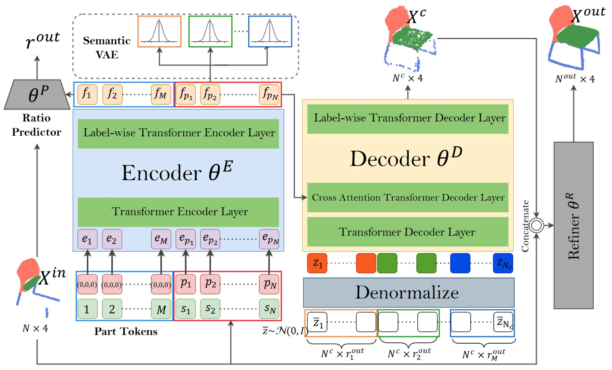

# SPoVT: Semantic-Prototype Variational Transformer for Dense Point Cloud Semantic Completion

This is the official repo for PyTorch implementation of paper "SPoVT: Semantic-Prototype Variational Transformer for Dense Point Cloud Semantic Completion", NeurIPS 2022. 

### [Paper](https://proceedings.neurips.cc/paper_files/paper/2022/hash/db6caae0f83e45e454e2215f07e7c5af-Abstract-Conference.html) | [Project page](https://haoyuhsu.github.io/spovt/) | [Video](https://slideslive.com/embed/presentation/38992362)

<!--  -->


## 🌱 Prerequisites
- OS: Linux Ubuntu 20.04
- GPU: NVIDIA RTX A6000 or NVIDIA RTX 3090
- Python: 3.8.13
- CUDA Toolkit: 11.6
- GCC/G++: 7.2.0
- Python package manager `conda`

## 🌱 Setup

### Datasets 

Download datasets from [here](https://drive.google.com/file/d/1l-XmkpYdJMzDyjs0mfzQKBImJ2K2NnTO/view?usp=sharing) and put datasets under folder `data/`.

### Environment

Install all python packages for training and evaluation with conda environment by following commands: 
```bash
conda create -n spovt python=3.8
conda activate spovt
conda install pytorch=1.13.0 torchvision pytorch-cuda=11.6 -c pytorch -c nvidia
conda install -c fvcore -c iopath -c conda-forge fvcore iopath
pip install "git+https://github.com/facebookresearch/pytorch3d.git"
pip install -r requirements.txt
```

### Pretrained checkpoints (optional)

Download pretrained model weights from [here](https://drive.google.com/file/d/1qzGVRT_vj_D7jJOVNap4iSnXZ3f-txwI/view?usp=sharing) for evaluation without training from scratch. Put checkpoint files under folder `ckpts/`.

## 🌱 Usage 

We provide training commands for only `car` experiment in the script file `train_car.sh`, and evaluation commands for all experiment in the script file `test.sh`. 

Please note that the pretrained checkpoints have undergone extensive training, so it may require more epochs to achieve the performance reported in the paper.

### Training 
Train the model on `car` category by running:
```bash
bash train_car.sh
```
The model is trained progressively in 4 stages.
```bash
# Reconstruction Training (autoencoder)
python ./main.py -record records/car_pretrain.txt -info "car pretrain" -bs 64 -lr 1e-3 -epoch 200 -interval 500 -cuda 0 -save ckpts/car_pretrain.pth -mode pretrain -cat car 

# Coarse Completion Training
python ./main.py -record records/car_train.txt -info "car train" -bs 64 -lr 1e-4 -epoch 200 -interval 500 -cuda 0 -save ckpts/car_train.pth -mode train -cat car -load ckpts/car_pretrain.pth

# Fine Completion Training (Stage 1)
python ./main.py -record records/car_refine.txt -info "car refine" -bs 64 -lr 1e-4 -epoch 200 -interval 500 -cuda 0 -save ckpts/car_refine.pth -mode refine -cat car -load ckpts/car_train.pth

# Fine Completion Training (Stage 2)
python ./main.py -record records/car_refine2.txt -info "car refine2" -bs 64 -lr 1e-4 -epoch 200 -interval 500  -cuda 0 -save ckpts/car_refine2.pth -mode refine2 -cat car -load ckpts/car_refine.pth
```

### Evaluation

Generate complete point cloud and render segmented images by running:
```bash
bash test.sh
```
The rendered images are saved under folder `seg_image`, and the generated point cloud are saved under folder `visualize`. Note that the evaluation metrics (e.g., mIoU, chamfer distance) are also calculated during evaluation.

## Qualitative Results

Visualizations of our complete point cloud and its reconstructed meshes are shown below. Please note that in our point cloud visualization, each color represents a specific part label within a category. For example, in the `airplane` category, red indicates the plane body, green for the wings, and yellow for the engine.

| Category | Partial Point Cloud | Complete Point Cloud (Ours) | Reconstructed Meshes |
|:--------:|:-------------------:|:---------------------------:|:--------------------:|
| `airplane` |  |  |  |
| `car` |  |  |  |
| `chair` |  |  |  |
| `table` |  |  |  |

## BibTex
```
@inproceedings{huang2022spovt,
  title = {SPoVT: Semantic-Prototype Variational Transformer for Dense Point Cloud Semantic Completion},
	author = {Huang, Sheng Yu and Hsu, Hao-Yu and Wang, Frank},
	booktitle = {Advances in Neural Information Processing Systems},
	pages = {33934--33946},
	year = {2022},
}
```

## Acknowledgement
This work is supported in part by the Tron Future Tech Inc. and National Science and Technology Council via NSTC-110-2634-F-002-052. We also thank National Center for High-performance Computing (NCHC) for providing computational and storage resources.
